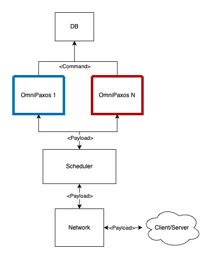

# eccos - Efficient Cross COnsensus Scheduling

## Prerequisites
- Docker
- Rust (Cargo)

## How to run
From the root of the repo run ```docker-compose up```.

## Project Structure


```
.
├── Cargo.lock
├── Cargo.toml
├── README.md
├── client -> Contains all the Client code
│   ├── Cargo.toml
│   ├── config.toml -> Configuration file for the client. Possible to set values such as request rate
│   ├── dockerfile
│   └── src
│       ├── listener.rs -> listener to listen to server responses
│       ├── main.rs
│       ├── request.rs -> generates requests at a given rate
│       └── stat.rs -> collects the latency on each request
├── data -> after each test run some metrics will be dumped here. If you are running it for the first time the directory will be created. If you are running it multiple times it will override your results
├── docker-compose.yaml -> here you can specify how your cluster looks like
├── docs
│   └── eccos_highlevel_architecture.drawio.png
├── network -> helper functions for networking
│   ├── Cargo.toml
│   └── src
│       └── lib.rs
├── server -> Contains all the server code
│   ├── Cargo.toml
│   ├── config.toml -> Configuration file for the server. Possible to set values such as partition ranges
│   ├── dockerfile
│   └── src
│       ├── common.rs -> Commonly used structs, types, enums
│       ├── consensus.rs -> Handles the replication of the database using omnipaxos
│       ├── db.rs -> Applies commands to our simple db
│       ├── main.rs
│       ├── network.rs -> Handles incoming and outgoing connections and forwards them to the other components
│       └── scheduler -> Schedules messages, forwards them both to the network and the consensus layer
│           ├── consensus_out_scheduler.rs -> Handles message flow from Consensus to the Network
│           ├── mod.rs
│           └── network_in_scheduler.rs -> Handles message flow from the Network to the Consensus
├── simple_db -> Very simple in memory database which contains chars as keys and values from 1 to 10
│   ├── Cargo.toml
│   └── src
│       └── lib.rs
```
